#  ridge Pal

### A Fridge Inventory Management Website

Ever found yourself staring at a fridge full of forgotten items, only to realise they're past their expiry dates? I've been there too so many times. These everyday challenges inspired the creation of Fridge Pal inventory website — a simple solution to keep track of what's in your fridge, reduce food waste, make grocery shopping smarter and more efficient.


### [Visit the live site here](https://ci-fridge-pal-49590c8364e1.herokuapp.com/)

*This is the final personal capstone project with Code Institute.*

## Table of Contents

- [ User Experience (UX) ](#user-experience-ux)
- [ Agile Project Management ](#agile-project-management)
- [ Features Implemented ](#features-implemented)  
- [ Future Features ](#future-features)  
- [ Technologies Used ](#technologies-used) 
- [ Validation & Testing ](#validation--testing)  
- [ Bugs ](#bugs)  
- [ Deployment ](#deployment)
- [ Resources ](#resources)  
- [ Credits & Acknowledgements ](#credits--acknowledgements)

## User Experience (UX)

### UX Design

#### Overview

The fridge inventory website is designed to help users efficiently manage and track the contents of their fridge. By organizing items based on name, quantity, location, category, and expiry dates, the app aims to reduce food waste, save money, and ensure that users are always aware of what they have on hand. The app offers intuitive features like notifications for expiring items and easy categorization to enhance the user experience.

#### Target User Base

- **Home Cooks and Families**: Individuals or families who cook regularly and need to keep track of their groceries and leftovers. They want to reduce waste, save money, and ensure they always have fresh ingredients available.
- **Health-Conscious Users**: People focused on healthy eating who want to track the freshness and quality of their ingredients. They might also want to categorize items by dietary preferences, such as gluten-free, vegan, or organic.
- **Busy Professionals**: Users with hectic schedules who often forget what's in their fridge, leading to expired food. They need a quick and efficient way to manage their fridge inventory and receive reminders when items are about to expire.
- **Eco-Conscious Consumers**: Individuals who are concerned about food waste and want to make sure they use all the food they purchase. They are motivated by sustainability and environmental impact.

#### User Requirements

1. **Simple Item Addition and Removal**:
- Users should be able to add items to the inventory easily.
- The website should allow quick updates to item quantities as users consume or purchase more of an item.
2. **Categorization and Filtering**:
- Users should be able to categorise items into groups such as dairy, vegetables, meats, etc.
- The website should allow filtering by category, expiry date, or quantity to quickly find specific items.
3. **Expiry Date Notifications**:
- The website should notify users when items are expired.
- The website should notify users when items are approaching their expiry date, allowing them to prioritise usage.
4. **Inventory Overview and Insights**:
- A dashboard that provides a clear overview of the fridge's contents.
- Visual aids like icons (e.g., water droplet for fridge; snow flakes for freezer) can be used to help users quickly know whether the item is in the fridge or freezer compartment.

#### Goal

**Reduce Food Waste**:
The primary goal of the website is to help users minimise food waste by keeping track of what’s in their fridge and using items before they expire. This aligns with both economic savings for the user and environmental sustainability.

**Improve Organization and Efficiency**:
By providing a clear and organized view of fridge contents, the website aims to make meal planning, grocery shopping, and cooking more efficient. Users should spend less time searching for ingredients and more time focusing on meal preparation.

**Encourage Sustainable Living**:
The website’s long-term goal is to encourage users to adopt more sustainable living practices by being mindful of food consumption and waste. Through features like recipe suggestions based on existing items (*this is a potential feature for future development*) and expiry notifications, the website supports a lifestyle that is both eco-friendly and cost-effective.

### User Flow Diagram

A simple user flow diagram was created to map out the logical path a user takes when interacting with the website. This diagram illustrates the process of user registration and login before accessing the inventory functionality, as well as the potential actions a logged-in user can take on the inventory (dashboard) page.
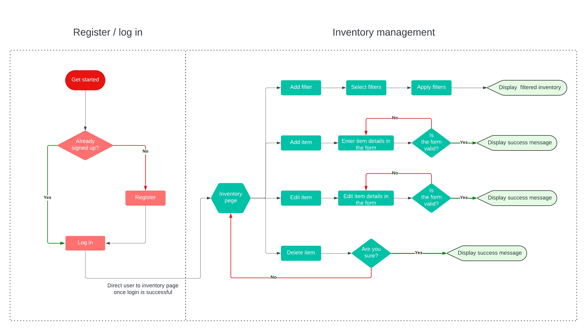

### Wireframe

Balsamiq Wireframes was used to create the wireframe which serves as a guide for the User Interface design of Fridge Pal website.

#### Laptop - Home Page
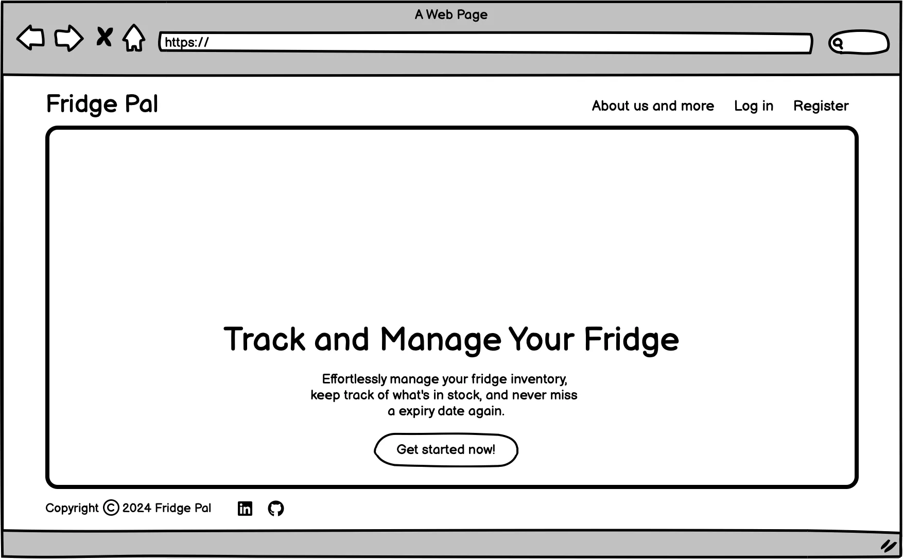

#### Laptop - About Page
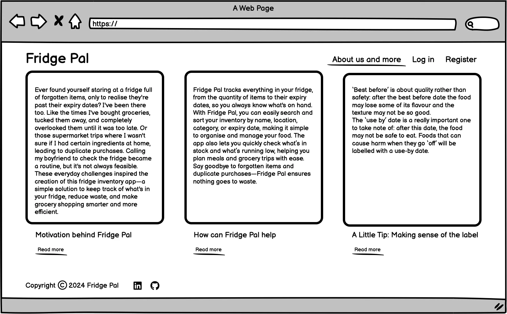

#### Laptop - Inventory Page
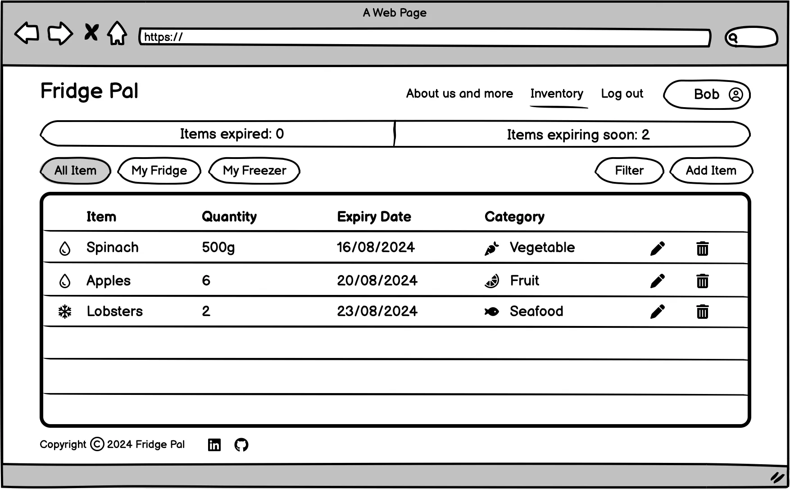

#### Phone
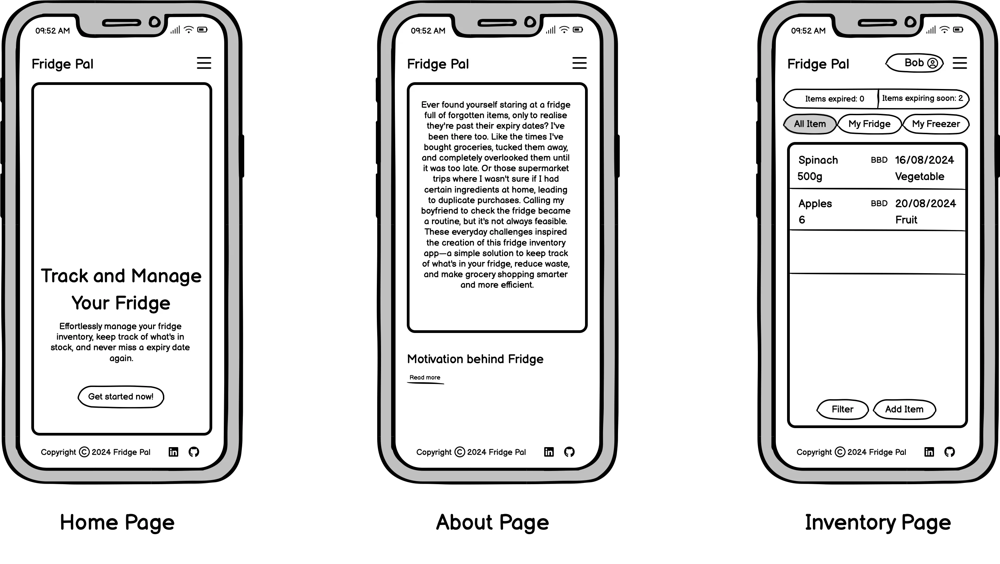

### Database Planning

Relational database was used for this project.
Lucidchart was used to create my database entity relationship diagram. The diagram illustrates the relationship between individual models.
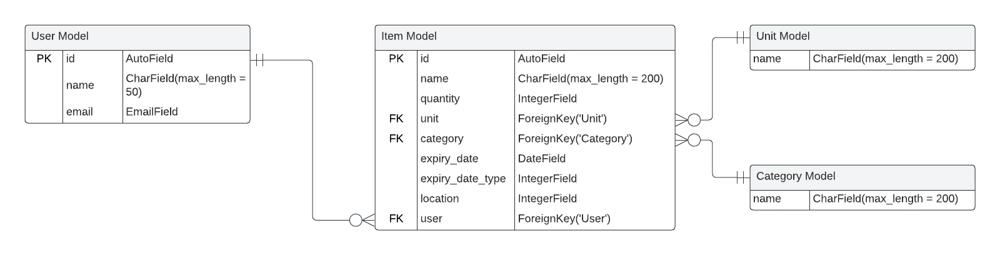

##### [ Back to Top ](#table-of-contents)

## Agile Project Management
In developing my fridge inventory web app, I adopted Agile methodology to ensure flexibility, continuous improvement, and efficient project management. The use of Agile allowed for iterative development, enabling me to frequently reassess and adjust the project scope. Central to this approach was the utilization of a Kanban board on GitHub Projects.
My Kanban board can be viewed [here](https://github.com/users/CrazyEggz/projects/4/views/1).

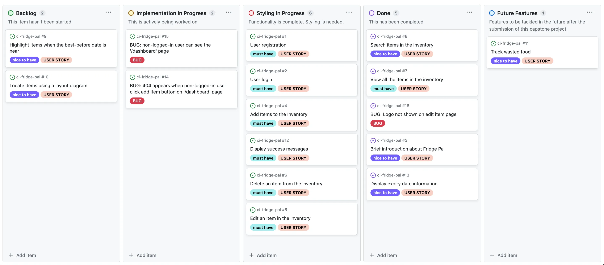

### Kanban Board Overview
I used the Kanban Board to track user stories, bugs needs to be fixed, manage tasks, and visualise the project’s progress in real-time.
My Kanban Board consists of the following sections:

- **Backlog**: This section contains all the tasks and user stories that were planned to be implemented. Tasks are ordered with the highest priority at the top.
- **Implementation In Progress**: Work in progress was tracked here. Tasks in this section are focused solely on the implementation of functionalities.
- **Styling In Progress**: This section tracks tasks where the functionalities have been completed, and styling is needed.
- **Done**: Tasks that were completed successfully were moved to this column and closed.
- **Future Features**: Features that were not implemented during this iteration and will be tackled in the future.

### User Stories Overview
User stories were instrumental in shaping the design of my Fridge Pal website by ensuring that every feature aligned with user requirements. Each user story was carefully crafted with specific acceptance criteria and associated tasks, providing a clear roadmap for development. By mapping these user stories onto the Kanban board, I was able to prioritize tasks effectively and ensure that the design process remained focused on delivering a user-centric experience.

### List of User Stories
**User Authentication**
- [User registration](https://github.com/CrazyEggz/ci-fridge-pal/issues/1)
- [User login](https://github.com/CrazyEggz/ci-fridge-pal/issues/2)
- [User logout](https://github.com/users/CrazyEggz/projects/4/views/1?query=sort%3Aupdated-desc+is%3Aopen&pane=issue&itemId=74778503)

**Inventory Management**
- [Add Items to the Inventory](https://github.com/CrazyEggz/ci-fridge-pal/issues/4)
- [Edit an Item in the inventory](https://github.com/CrazyEggz/ci-fridge-pal/issues/5)
- [Delete an item from the inventory](https://github.com/CrazyEggz/ci-fridge-pal/issues/6)
- [View all the items in the inventory](https://github.com/CrazyEggz/ci-fridge-pal/issues/7)
- [Search items in the inventory](https://github.com/CrazyEggz/ci-fridge-pal/issues/8)
- [Display expiry date information](https://github.com/CrazyEggz/ci-fridge-pal/issues/13)

**Notification & Alerts**
- [Display success messages](https://github.com/CrazyEggz/ci-fridge-pal/issues/12)
- [Highlight items when the best-before date is near](https://github.com/CrazyEggz/ci-fridge-pal/issues/9)

**About Fridge Pal**
- [Brief introduction about Fridge Pal](https://github.com/CrazyEggz/ci-fridge-pal/issues/3)


##### [ Back to Top ](#table-of-contents)

## Features Implemented

### Home Page
- A one-line introduction about the website, ensuring users know what this website does at first glance.
- The **Get Started Now** button provides users with a quick and easy way to begin using the website.

### About Page ###
- Non-logged-in users can visit this page to gain a better understanding of what Fridge Pal does before deciding if they want to use it.
- Images are displayed as cards.
- When the mouse hovers over each image, the image darkens and text is shown over it.
- Buttons under each image allow users to read more, and the text on the button changes when clicked, providing users with a helpful hint.

### Inventory Page ###
- Logged-in users can add new items to the inventory.
- Logged-in users can edit and delete existing items.
- When a user clicks the delete button, a modal window pops up asking if they are sure about the deletion.
- A message will appear at the top of the screen when an item has been successfully added, edited, or deleted.
- A bar above the table shows the live count of expired items and items expiring within 3 days.
- Expired items and soon-to-expire items will be highlighted in the inventory table if present.
- **All items**, **Fridge**, and **Freezer** buttons allow users to easily view all items, fridge items, and freezer items.
- The **Filter** button allows users to search for an item, and filter items by their expiry dates, categories, and days until expiration.
- The **Filter** button will be highlighted reminding the user that filters are being applied.
- A popover is added to the table head Expiry date to remind users of the difference between best-before and use-by dates.

### Registration Page ###
- Secure login functionality allows users to log in securely.
- Successful registration automatically logs the user in and redirects them to the home page.

### Log In Page
- Secure signup functionality allows users to register securely.
- Successful login redirects users to the inventory page.

### Log Out Page
- A message is displayed telling the user they have been logged out successfully.
- After successful logout, users have the option to either log back in or go to the home page.
  
### Nav Bar/ Footer
- User status is clearly shown in the top right corner, letting users know whether they are logged in or not.
- The navigation bar displays different content based on whether the user is logged in.


##### [ Back to Top ](#table-of-contents)

## Future Features

### Locate items using a layout diagram:
  - User can generate a diagram of their fridge layout.
  - Users can enter the compartment number when they create a new item
which will be mapped to the fridge layout diagram.
  - The diagram can show users which compartment an item is stored in.

### Track wasted food:
- Consume or waste can be selected when users delete an item.
- A separate table keeps track the wasted food.

##### [ Back to Top ](#table-of-contents)


## Technologies Used
| Technology | Reason |
| --- | --- |
| HTML | Page Structure
| Javascript | Event Listeners, Modals, Popovers
| CSS | Page Styling
| Bootstrap 5 | Page Styling
| Bootswatch | Page Styling
| Font Awesome | Icons
| Python | Backend Server
| Django | Backend Framework
| CodeInstitute PostgreSQL | Database
| Balsamiq Wireframes | Design
| LucidChart | Design
| Git | Version Control
| GitHub | Code Hosting and Project Management
| Heroku | Project Deployment
| Fooocus | AI Image Generation using LLMs
| Swarm UI | AI Image Generation using LLMs
| Flex.1 Dev | Extra LLM for Image Generation
| VSCode | IDE
| GitPod | IDE

##### [ Back to Top ](#table-of-contents)

## Validation & Testing

### HTML Validation

I used the [W3 HTML Validator](https://validator.w3.org/) to check that my HTML conforms to the standards they impose. The un-authenticated endpoints were checked using the Heroku URL and authenticated endpoints were checked via pasting the HTML from the network call into the Direct Input tab. All warnings and errors were fixed.

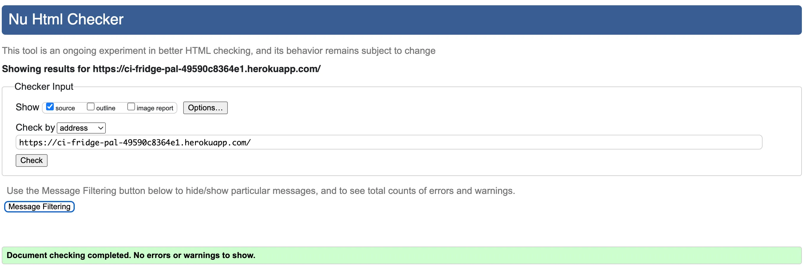

### CSS Validation

I used the [W3 CSS Validator](https://jigsaw.w3.org/css-validator/) to check that my CSS conforms to the standards they impose. The CSS files were passed using the Heroku URL. All warnings and errors were fixed except one warning saying that they don't check dynamic CSS variables.

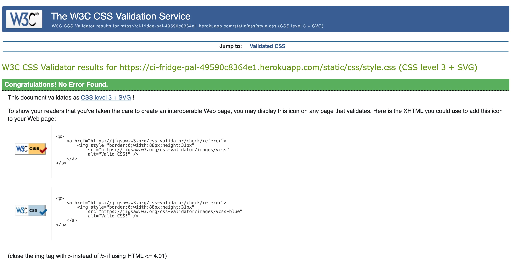

### Javascript Validation

I used [JSHint](https://jshint.com/) to check that my Javascript is sane. Each javascript file was copied into the website and all warnings and errors were fixed except one warning saying that bootstrap is undefined. This is because it is defined in another javascript file.

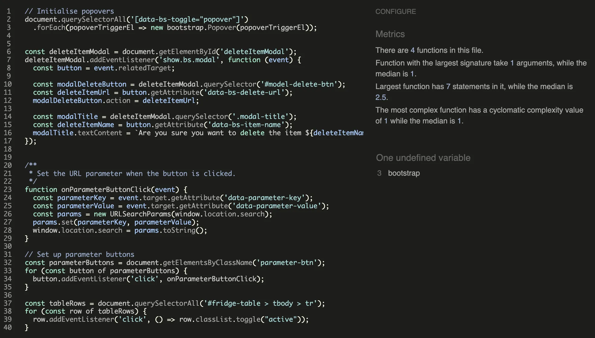

### Python Validation

I used the Code Institute checker as well as the `pycodestyle` terminal program to check for Python pep8 compliance. All python issues were fixed either directly by me or via the Python Formatter in VS Code. I excluded the `.vscode` and `migration` folders as the former is to do with the editor and the latter is generated by Django.

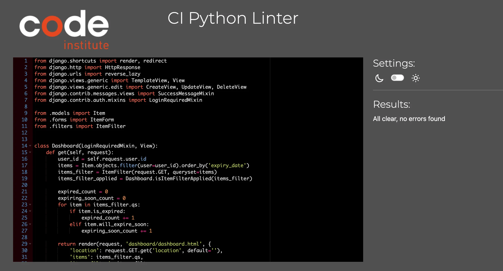
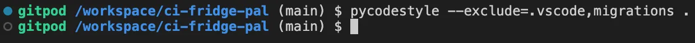

### Automated Testing
While developing the Fridge Pal website, I wrote comprehensive Django tests to ensure the reliability and correctness of the application. These tests covered filters, forms, views, and models, helping to maintain data accuracy and consistency across the site.

For filters, I verified that the filtering logic returned the expected results, such as filtering the data down to a specific location. The form tests ensured proper input validation and error handling, crucial for user interaction. View tests confirmed that expected data was present, security was enforced, and appropriate HTTP responses were returned, maintaining a consistent user experience. Lastly, model tests validated object functions such as expiry checking.

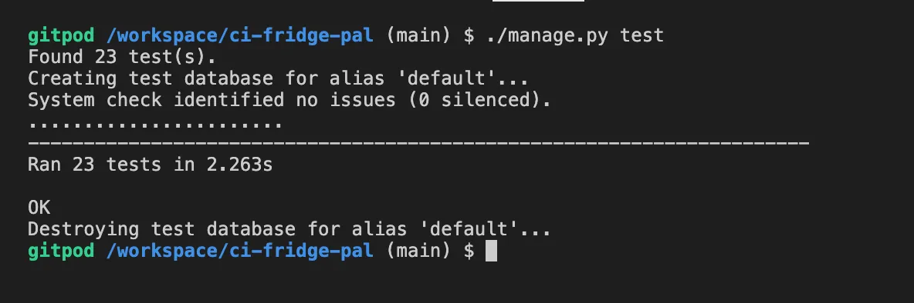

### Manual Testing
While automated testing helps significantly with catching bugs, there are sometimes things that are very hard to catch with automated testing, like something looking a bit odd in the frontend or a button mysteriously disappearing. Checking that the frontend looks as expected is extremely difficult as it is hard to quantify what a test should look for. To deal with this, manual testing was done as well in the form of testing user stories, as well as some small other tests written below in user story format for consistency.

| **User Stories** |  Tested |  Works As Intended |
|  --- | --- | --- |
| As an **admin**, I can **edit the set of categories and units from the admin panel** | ✅ | ✅
| As an **unregistered user** I can **find out about this website before registering** |✅ | ✅
| As an **unregistered user** I can **register** |✅ | ✅
| As an **unregistered user** I **cannot access the dashboard** |✅ | ✅
| As an **unregistered user** I **cannot access the add item page** |✅ | ✅
| As an **unregistered user** I **cannot access the edit item page** |✅ | ✅
| As an **unregistered user** I **cannot submit a POST request to the delete item page** |✅ | ✅
| As a **user**, I can **log in** |✅ | ✅
| As a **user**, I can **log out** |✅ | ✅
| As a **user**, I can **view my dashboard** |✅ | ✅
| As a **user**, I can **see any expired and soon to expire items easily** |✅ | ✅
| As a **user**, I can **filter to everything, the fridge, or the freezer** |✅ | ✅
| As a **user**, I can **create a new item** |✅ | ✅
| As a **user**, I can **edit an existing item** |✅ | ✅
| As a **user**, I can **delete an existing item** |✅ | ✅
| As a **user**, I can **see feedback whenever interacting with an item** |✅ | ✅
| As a **user**, I can **search for a item by case-insensitive name** |✅ | ✅
| As a **user**, I can **search for a item by category and time left until expiry** |✅ | ✅
| As a **user**, I **cannot edit another user's item** |✅ | ✅
| As a **user**, I **cannot delete another user's item** |✅ | ✅
| As a **user**, I can **view a responsive dashboard layout on my phone** |✅ | ✅

##### [ Back to Top ](#table-of-contents)

## Bugs
##### [ Back to Top ](#table-of-contents)

## Deployment
### Deployment with Heroku
Fridge Pal was developed locally in Gitpod, with frequent commits pushed to the GitHub repository. This project was deployed to Heroku, which integrates well with GitHub for continuous deployment. The deployment steps can be summarised as below:

1. Create a database in [Code Institute CI](https://dbs.ci-dbs.net/). (**Note**: If you are not a Code Institute student, setup a Postgres or another Django-compatible database elsewhere)
2. Clone the repository.
3. Create an `env.py` file with the following file contents (fill in the `<...>` fields):
```python
import os

os.environ["DATABASE_URL"] = "<YOUR DATABASE URL>"
os.environ["SECRET_KEY"] = "<A RANDOMLY GENERATED SECRET KEY>"
os.environ["DEBUG"] = "1"

```
> [!CAUTION]
> `en.py` file contains sensitive information. Make sure not to push it.

4. Run `pip3 install -r requirements.txt` to install the dependencies.
4. Run `python3 manage.py migrate` to initialise your database.
5. Run `python3 manage.py createsuperuser` to create a superuser.
6. Login to Heroku and create a new deployment.
7. Connect the Heroku app to your GitHub repo
8. Create the following configuration variables (DO NOT CREATE `DEBUG`. This is not safe on a production environment):
- DATABASE_URL
- SECRET_KEY
9. Click the "Deploy" button to deploy the app
  
##### [ Back to Top ](#table-of-contents)

## Resources
* [Django docs](https://www.djangoproject.com/)
* [Crispyforms docs](https://django-crispy-forms.readthedocs.io/en/latest/)
* [Stack Overflow](https://stackoverflow.com/)
* [W3School](https://www.w3schools.com/)
* [GeeksForGeeks](https://www.geeksforgeeks.org/)
* [YouTube](https://www.youtube.com/)

##### [ Back to Top ](#table-of-contents)

## Credits & Acknowledgements

### Images
All images were generated using free LLMs. See the [Technologies Used](#technologies-used) for details.

##### [ Back to Top ](#table-of-contents)
